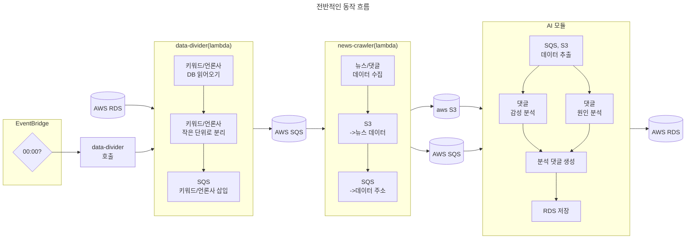

# naver news scrapper
네이버 뉴스를 주기적으로 스크래핑하기 위한 로직을 구현하는 프로젝트입니다. 데이터베이스에 키워드 및 언론사 목록을 입력해두면, 매일 자정에 해당 데이터를 데이터베이스 상에서 가져온 후 각 키워드에 대한 뉴스 본문 및 댓글 목록을 수집한 후 ai 서버를 위한 큐에 저장합니다. 
## 사용 기술
aws에서 제공하는 프리티어 서비스를 이용했습니다.
- lambda: 키워드 분리(data-divider), 뉴스 수집(news_crawler) 기능 구현
- eventbridge: 매일 자정마다 키워드를 수집하기 위해 스케줄러
- sqs: lambda 및 ai 서버 데이터 전달
- S3: 수집 데이터를 ai 서버에 전달
## 동작 흐름도

전체적인 동작 구상은 다음과 같다.
1. EventBridge 스케줄링 서비스를 이용하여 UTC +9 기준 첫번째 람다 함수 실행
    - 첫번째 람다 함수는 데이터 처리 규모를 15분 이내로 쪼갠다. (람다 최대 실행 시간 15분 제한 존재)
    - 키워드 / 언론사 정보를 적절하게 쪼개서 SQS 큐에 삽입
2. 두번째 람다 함수는 SQS에서 키워드 및 언론사 관련 정보를 읽어들인 후 해당 데이터  기반으로 뉴스 기사 / 댓글 정보 수집
    - SQS는 한번에 256kb까지의 데이터만 한번에 보낼 수 있으나, 수집한 데이터의 크기는 256kb를 초과하는 경우가 많았음.
    - 읽은 데이터를 S3에 임시로 저장, 해당 파일의 주소를 SQS 상에 담아 전송
3. AI 모듈이 동작함.
    - 특정 키워드에 대한 뉴스/댓글을 크롤링 하여 S3에 저장
    - SQS에서 파일 url 정보를 읽어옴(읽은 후, 읽은 데이터 SQS에서 제거) 
    - 파일의 url을 기반으로 S3 버킷에서 데이터를 읽어옴
    - S3에서 읽은 파일 제거
    - 읽은 내용 기반으로 감성 / 원인 분석 후 DB에 저장
## 고려한 점
### lambda
aws lambda는 한번에 최대 15분 실행됩니다. 1개의 키워드, 1개의 언론사에 대해 데이터를 수집하면 lambda 기준 10~20초가 소요됬습니다. 이때 키워드 개수, 언론사 개수가 많아지게 되면 lambda 함수 하나에서 처리할 수 있는 시간을 초과하여 데이터 처리에 실패할 수 있습니다.

위 문제를 해결하기 위해 lambda 함수를 data-divider, news_crawler로 구분했습니다.
- data-divider: 키워드, 언론사 목록을 하나의 lambda 함수에서 처리할 수 있도록 쪼갭니다.
- news_crawler: data-divider에서 분리한 키워드 / 언론사 목록을 이용하여 데이터를 수집합니다. 수집된 데이터는 S3에, 데이터 주소는 sqs에 저장됩니다.

### S3
news_crawler 함수는 뉴스 관련 데이터를 수집합니다. 이때 sqs는 기본적으로 256KB의 크기까지만 큐에 삽입할 수 있어(확장을 이용하면 2GB까지 가능), 기본적으로 300KB 이상의 크기를 가지는 뉴스 정보를 직접 ai 서버로 이동할 수 없습니다. 따라서 뉴스 정보를 보관하기 위한 공간이 필요했고, 이를 위해 aws S3 서비스를 이용했습니다.

초기에는 수집한 뉴스 데이터를 mysql 또는 mongodb에 저장하는 방식을 고려했습니다. 팀 내 논의를 통해 현재 데이터는 AI 서버에서 사용된 후 제거되는 것으로 합의한 후 S3를 사용하기로 했습니다.

S3를 사용하기로 결정하기 전에 고려한 사항들입니다.
1. 수집한 뉴스 데이터는 사용 후 제거되므로 DBMS에 저장하기에는 부적합합니다.
2. RDBMS의 경우 댓글을 저장할 때 정규화가 필요하므로 primary key, foreign key를 추가해야 합니다.
3. RDBMS의 경우 데이터를 가져올 떄 join을 수행해야 하므로(댓글) 성능이 떨어질 수 잇습니다.
4. mongodb의 경우 정규화 없이 기사와 댓글을 함께 저장할 수 있긴 하나 mongodb atlas 기준 프리티어로 제공하는 데이터베이스의 크기가 512MB 뿐이므로 장기적으로 사용하기 어렵다고 판단했습니다.
